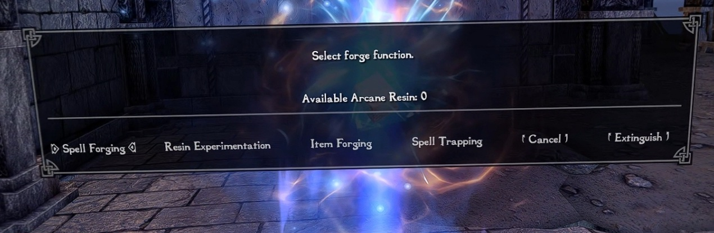
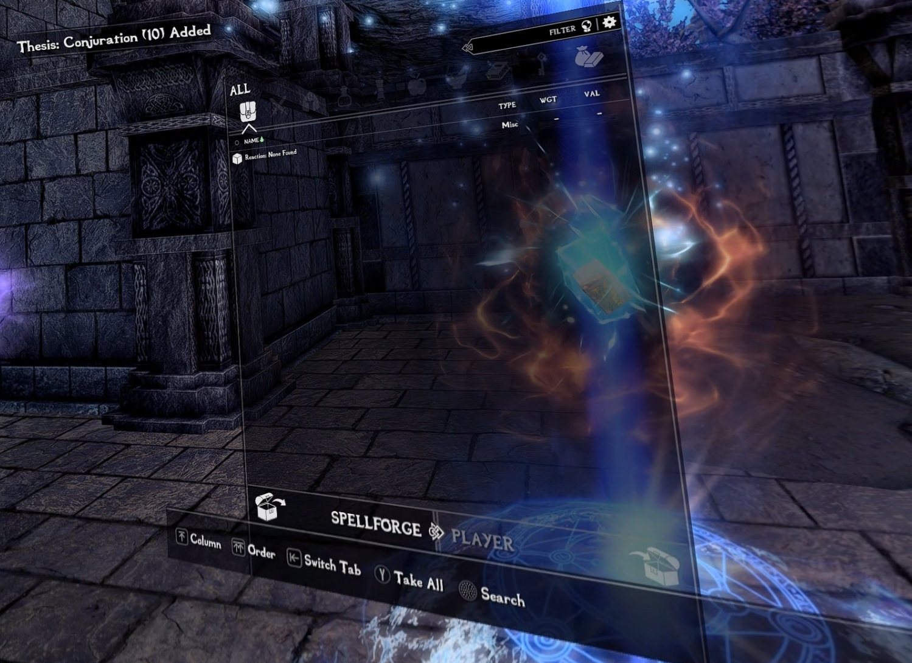
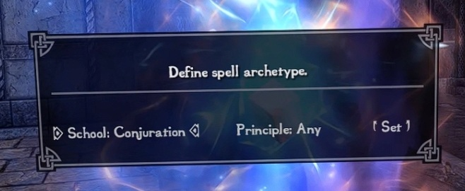
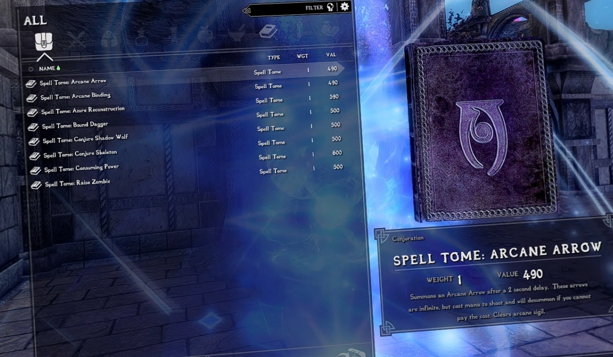

# Gameplay Guide

## Essential VR mod tutorials
If this is your first time playing Skyrim VR, you may want to watch these tutorial videos to understand how some of the essential mods function.
- https://youtu.be/CEi7gwN8hgg
- https://youtu.be/Nd9A-_G2eXU

## Starting out
When you first start a new game, depending on your choice of optional mods, you may either play through the vanilla intro, or skip it and find yourself directly inside the Realm of Lorkhan where you will set up your character.

*If you chose the vanilla start, you will still be able to reach the Realm of Lorkhan during the intro from a crystal inside Helgen's keep.* 

The Realm of Lorkhan mod allows you to craft your character. You may pick a shrine and standing stone bonus to start with. Make sure to speak with Sera the Trainer to increase your starting skills as you wish. If you don't get a training dialog when talking to her, make sure you followed my earlier instructions by **saving your game, going back to the main menu then reloading.**

The training system offered by Sera the Trainer is available throughout all of Skyrim. Most NPCs will offer you training in a few skills they are skilled in. To train, you will need gold and Training Points (TP) which you will gain at each level up. This is the main way to increase your skills, as regular skill leveling has been drastically slowed down. You can check your available TP at any time through the Training Potential power. The gold required to train will change depending on factors such as your skill level, your trainer's skill level and your relationship with the trainer (friends charge less). 

Sera the Trainer charges less gold for her training than most other trainers in Skyrim. Don't skip out on the opportunity to raise some of your skills here, but consider keeping at least a little bit of gold for later.

The Realm of Lorkhan will also allow you to select Handicaps that will further define your character if you wish. Each Handicapped skill permanently grows roughly half as fast as a regular skill, but also grants you 2 specialization points, up to a maximum of 12. You may spend these specialization points to receive various bonuses. Prices are as follows : 
- +1 perk point : 5 Specialization Point
- +5 attribute points (Health, Stamina or Magicka) : 1 Specialization Point
- Become a Vampire : 1 Specialization Point
- Become a Werewolf : 12 Specialization points

A Handicap is a very severe penalty, so make sure to only use them with skills you don't intend to use much or at all.

Finally, you can use the [Book of Origins](https://www.nexusmods.com/skyrimspecialedition/mods/167166) to determine a goal for your character. If you do so, you will receive a penalty until that goal is accomplished and, once it is done, a reward commensurate to the difficulty of the task.

Once you teleport at one of the crystals, you'll be dumped into Skyrim in the place you chose. Make your choices wisely though - once you leave, you cannot return.

## CBPC VRSex
[CBPC VRSex](https://www.loverslab.com/files/file/29662-cbpc-vrsex/) is a mod to create basic sex interactions without taking control away from the player. ~~It requires the player to have a penis. If you are playing a non-futa female, you may use the "Auto-futa" option in the MCM to temporarily grow a penis during VRSex scenes.~~ Penis not required anymore, vagina on vagina collision works fine now. Though you can still use Auto-futa if you'd like.

If you wish to use that system, read the manual in your inventory or on the stand next to the "VRSex Training Dummy" NPC in the Realm of Lorkhan. Feel free to try out the mod on that Training Dummy to figure out how things work.

Upon opening the manual, you will be asked for an orientation which will activate the mod for either Male NPCs, Female NPCs, or both. If you choose Male or Female NPCs, entering an ostim or sexlab sex scene with the gender you didn't choose will also give you a temporary 'disgust' debuff. If you choose both, you will never get a debuff but some VRSex buffs will be harder to obtain.

To start, I recommend activating the Incubus Arts power then groping the VRSex dummy until she collapses. You can either keep groping her while she's collapsed, or use the Molag Bal's Compulsion spell to force her to take a pose. There are only two poses at the moment, chosen at random. Just cast Molag Bal's Compulsion spell again to switch. Either way, if you keep groping her, your character should strip and get an erection. The mod will then detect collision between penis and vagina, so set yourself in the right position and start having sex. After a little while, you will receive bonuses depending on the level of your partner. If your partner is lower level than you are, this will likely only be a temporary stat boost, but a higher level partner may grant you a permanent point of health or magicka. Details on these bonuses are described in the VRSex Manual.

You can technically also use the Knockout Arts power instead of Incubus Arts, but a starting character will find it extremely hard to use. The knockout combo will only activate if you have 90 stamina. As parrying uses up your stamina, you will often find yourself parrying an enemy attack and ruining the combo. Before you start using Knockout Arts instead of Incubus Arts, either increase your warrior skills to learn Improved Knockout Arts or increase your stamina.

The third option, Molag Bal's Subjugation, is easier to use than both Incubus Arts and Knockout Arts but is entirely unavailable as a starting character and requires investing into Illusion.

## Sexlab and Ostim
Sexlab scenes are used in this list mostly in three situations : You are defeated by an enemy, you use Sexlab Enchantress spells, or you start a scene from Sexlab Solutions.
Sexlab scenes can be directed through gestures, similarly to vrik gestures, though if nothing is done they will complete automatically.

Ostim scenes are started by most of the other mods, such as the Romance mod, the follower mods, Simple Player Prostitution or Amorous Adventures. 
Ostim scenes can be directed by using the Spell Wheel.

As long as there is penetration, you will still receive the bonuses from CBPC VRSex during Sexlab or Ostim scenes.

Try not to start scenes in public - guards don't like it when you walk around naked, and that includes having sex in public. Chilldren will also report you.

Also, depending on the circumstances of the scene, there may be a tiny chance you will receive an STD. STDs are diseases that require a slightly modified cure disease potion to cure. As long as you take care of them early they should be relatively benign, but they can get worse if you keep going at it untreated.

## Player Prostitution
You can attempt prostitution by talking with people while wearing a wench outfit or any of the body slot outfits that can be crafted while holding the Tahrovin Lingerie Book. The chance of people being willing to pay for your services depends mainly on your Speech skills, but also various other factors. The Desirable Speech perk will also make things much easier.

The gold you earn will also depend on your Speech skill. However, you will also receive more gold for your work when performing at an inn with the innkeeper's permission, which requires buying a room first. Performing outside, or performing at an inn without asking for permission first, will result in less gold.

## Playing a mage
Being able to use magic is not a given in Tahrovin Grit and will require an investment. Your magicka regeneration in combat is faster, but your starting magicka is only 50 and you do not start with any spells (other than the various debug spells) unless you are one of the races granted a bonus spell (Breton, Dunmer, Altmer). Furthermore, you will find that spell books are prohibitively expensive for a starting character. You will still find spell books in the world as usual, but it may be tempting to sell them instead of learning the spell they contain.

Rather than spell books, your main way to acquire new spells will be through Spell Forging.

If you want to start the game as a mage right away, I recommend doing the following : 
- Increase your magicka by picking the Mage, Lady or Atronach standing stones, otherwise you'll lack the magicka to even forge novice spells at first. As a more temporary measure, Julianos' shrine can also help. Note that Altmer and Imperials already start with extra magicka and may not necessarily need to do that.
- Increase one of your magic skills to at least 20 at Sera the Trainer if possible. You should have enough gold and TP to raise a skill to 20 right away. This will allow you to learn a novice spell through Spellforge immediately.

Cast the "Conjure Spellforge" spell on the ground to summon the forge and select the bottom node to access the forge's main functions. Select the Resin Experimentation option.

For every level you reach above 15 in a magic skill, you will receive School Theses upon using the Resin Experimentation option. Later, you will also be able to use this menu to create Arcane Resin by incinerating alchemy ingredients in the forge. If you've raised a magic skill to 20 earlier, you should immediately receive 10 school theses here.

Exit the spellforge menu, use the middle node in the forge and select the school you have trained in.

Once set, use the bottom node again and select Spell Forging > Synthesize spell selection. This will grant you a selection of all spells that match your specifications - here you should see all available Novice spells from your selected school, but later you can use the middle and top nodes in the forge to restrict that list further. Select a spell and exit the menu.

You will automatically equip an "enkindle" ability that you can channel to drain your magicka to power the forge. If you have enough magicka (60 for a novice spell) and channeled the enkindle ability to completion, the forging process is finished and you will receive the spell. Don't worry, if you fail you can retrieve your school theses and resin by interacting with the forge (nothing is lost).

As you play, keep raising your magic skills to gain more school theses and learn more spells. You can also create Arcane Resin by experimenting with ingredients in the spellforge, which will work the same as School Theses but allow you to learn spells from any school. Read the spellforge mod description (https://www.nexusmods.com/skyrimspecialedition/mods/46482) for more details. Creating Arcane Resin through Spellforge usually requires powerful ingredients such as Nirnroot. However, some recipes work with large quantities of mundane ingredients (such as 10 units of Bone Meals). If you try to experiment with the wrong quantities, you will still learn the recipe for later, with the exact quantity needed. If you have a decently valuable alchemy ingredient, try to throw it in the Spellforge and see what happens !

Other changes compared to base Tahrovin : 
- Triumvirate has been removed
- [Balance adjustments for Apocalypse](https://www.nexusmods.com/skyrimspecialedition/mods/104987) deals with the worst offenders, such as turning Ocato's Recital into a series of perks or switching Ghostwalk from a novice to an expert spell.
- Two Darenii spell packs have been added, [Abyss](https://www.nexusmods.com/skyrimspecialedition/mods/83329) and [Arcane](https://www.nexusmods.com/skyrimspecialedition/mods/91602).
- [Thaumaturgy](https://www.nexusmods.com/skyrimspecialedition/mods/57138) rebalances enchanted items
- [Sexlab Enchantress](https://www.loverslab.com/files/file/9712-sexlab-enchantress-se) provides sexlab-related versions of the basic illusion spells. These spells do not replace the actual basic illusion spells here, there will usually be a regular version and an erotic version of the spell that can be learned separately.  
- The [Spellsiphon](https://www.nexusmods.com/skyrimspecialedition/mods/26627) magic system is available, but not immediately. To unlock it, use the Arcane Manual in your inventory, you will need at least 25 Restoration and either 20 Destruction or 20 Conjuration.
- The [Conduit](https://www.nexusmods.com/skyrimspecialedition/mods/158538) magic system is similarly locked and requires 15 Enchanting, 20 One-handed and 25 in any spellcasting skill to unlock.
- Various other small additions : [Immersive Bend Will](https://www.nexusmods.com/skyrimspecialedition/mods/62233), [Perception](https://www.nexusmods.com/skyrimspecialedition/mods/7559), [NPCs react to Necromancy](https://www.nexusmods.com/skyrimspecialedition/mods/70428)[/Invisibility](https://www.nexusmods.com/skyrimspecialedition/mods/91480).
- Sexlab Eager NPCs has been removed, and [Sexlab Romance](https://www.loverslab.com/topic/127240-sexlab-romance-se/) has been added.

## Playing a warrior
The main change you will notice as a warrior is that vanilla weapon blocking has been removed entirely in favor of [Pseudo Physical Weapon Collision and Parry](https://www.nexusmods.com/skyrimspecialedition/mods/100781). By default, blocking with a shield still works as normal - hold it in front of you to block. However weapons no longer block at all, they can only use the Pseudo-physical parry system by intercepting the enemy's attack. By moving the weapon fast enough as you parry or block, you may even stagger the enemy. Blocking or parrying will cost Stamina instead of Health. Parrying with a weapon will cost stamina if you are slow, but if you move the weapon fast enough you will regain Stamina instead of losing it. If you are out of Stamina, weapon parrying becomes impossible and shield blocking starts to use Health instead.

You will also be able to block and parry arrows and spell projectiles by intercepting them physically. While holding trigger, projectiles will be slowed at the cost of a bit of magicka, making that process easier.

The settings for pseudo-physical parry are less forgiving than the ones in base Tahrovin. You will not be able to parry by simply standing still, make sure to move your weapon as you intercept.

You can throw humanoid enemies either by yanking them with both hands, or by yanking their foot. This requires a fair amount of stamina, but not only will it make the enemy vulnerable, if they have 50% health or less it will also give you a brief window while they are down during which you will be able to strip them of their weapon and/or armor, by either grabbing them with both hands or using the gravity glove. Some of the new perks in Light and Heavy armor will make you better at throwing enemies around.

All attacks, even basic ones, cost a bit of stamina depending on the type of weapon being used (less stamina for daggers, more for two-handed weapons, and even more for two-handed weapons wielded with one hand). When out of Stamina, you will be slower and deal significantly less damage. It might be better to pace yourself and focus on defense when you start running low - remember that a fast enough parry will also help you regain Stamina.

[Weapon Throw VR](https://www.nexusmods.com/skyrimspecialedition/mods/31374) is present, but by default can only be used only with specific throwing weapons. These weapons are cheap, disposable and relatively weak in melee, but much more effective when thrown. They can be bought in shops or crafted. You may eventually unlock the ability to throw and recall regular weapons with perks.

Torches are fairly important as a warrior. Some areas will be too dark to fight in properly without a light source. The shortcut (left thumbstick + controller down) will drop one of your torches in front of you. You can grab it and walk around, and drop it at any time if you need your second hand, then pick it up when you're done. It will continue to illuminate the area while down on the ground. Make sure to bring plenty of spares as you may often lose track of them or forget to pick them up.

Finally, you will no longer be able to do power attacks unless you are able to pay the full stamina cost.

## Playing a thief
Pickpocketing and lockpicking are harder than usual if you're unskilled, but easier if you do raise your skills. [More NPC Pocket Money](https://www.nexusmods.com/skyrimspecialedition/mods/31375) adds a bit of extra gold to citizens for you to steal. [Lock-related Loot](https://www.nexusmods.com/skyrimspecialedition/mods/11342) makes sure that Expert-level chest whose lock you just picked doesn't contain three gold pieces and a sweetroll. [Broken picks](https://www.nexusmods.com/skyrimspecialedition/mods/95275) makes it so breaking your lockpick will throw you out of the lockpicking minigame and force you to start from scratch - make sure to check for patrolling guards ! [Mum's the word NG](https://www.nexusmods.com/skyrimspecialedition/mods/77409) ensures that low-value loot will no longer be flagged as stolen and can be sold anywhere. Even for the more valuable loot, you will no longer have to join the thieves' guild to sell it : anything recognizably stolen can now be sold at any Khajiit caravan.

You will have a Disguise power that can toggle on and off the ability. When it is on, if you are wearing at least 3 pieces of equipment belonging to a same faction and you spend some time hidden from view (wait until the notification appears), you will become disguised as a member of that faction. The disguise is not foolproof - its effectiveness depends on your Pickpocket skill, distance, and the Method Actor Pickpocket perks. You will lose all bounties incurred while in disguise if you manage to escape unrecognized.

Light is a very important factor when it comes to sneaking in Grit. You will probably want to grab Night Vision, either with the "Sharp Eye" sneak perk or through any other means. Sneaking around with a torch or a candlelight spell is generally a bad idea.

Some of the perk changes from the usual [Vokriinator](https://www.nexusmods.com/skyrimspecialedition/mods/26702) stuff will impact thieves. Most importantly, the Pickpocket and Lockpicking Mastery perks will now allow you to train both skills at once for the price of one.

## Leveling
Instead of increasing your level by raising your skills, the [Experience](https://www.nexusmods.com/skyrimspecialedition/mods/17751) mod lets you increase your level as you adventure, exploring Skyrim and accomplishing quests. The leveling curve has been modified to provide a slower-paced experience.

Levels and skills have not been decoupled however. As explained earlier, you will be able to train your skills as you wish each level thanks to [Trainers Galore](https://www.nexusmods.com/skyrimspecialedition/mods/20360) and its [Training Points](https://www.nexusmods.com/skyrimspecialedition/mods/103092) addon. Almost every NPC can now train you in a few skills as long as you have the gold and the Training Points. Note that any buffs or penalties you may receive to experience gain will also apply to training. It is also important to note that improving your relationship with a trainer will make the gold cost of training cheaper, but that more skilled trainers will charge more.

Eventually, you will also be able to use the Self-Improvement power to train yourself. This can only be done once per day, requires both mastery perks for the skill to be unlocked, costs 1 more TP but costs no gold.

Skyrim's regular skill leveling is not gone, but is now much slower. Your skills start at 5. You may be able to progress through the lower levels of skill entirely on your own, but you will have a hard time going further without seeking training.

At higher levels, you may have a hard time finding a sufficiently-skilled trainer. In that case, scrolls of the Ethereal Instructor are sold by many merchants, and can be crafted at a tanning rack. They are fairly expensive but can be an alternative way to find proper training by summoning Master-level trainers.

## Crafting and Economy
You may notice that the only crafting workstations you are able to use from the start are the Tanning Rack and the Smelter. Otherwise, you will need to increase your skills first. Smithing workstations require a smithing skill of 15. Alchemy and Enchanting workstations require their skill at 20.

If you ever obtain a home for your character, you may use Linked crafting Storage to make the process of crafting easier. By putting a Crafter's Link Stone along with as many ingredients and other crafting materials as you want in a container inside your player home, you may access them anytime and anywhere when using a related crafting station. This, however, will only function for containers inside a proper player home. You begin play with a Crafter's Link Stone but may create more at a smelter.

Until you learn to craft for yourself, smiths and enchanters of skyrim can do the work for you thanks to Honed Metal. Tempering services are the cheapest ones, crafting services are in the middle, and enchanting services are fairly expensive. Prices will of course depend on the equipment being tempered/crafted, but also on the artisan - the more skilled they are, the more gold they'll ask for. There will be a noticeable bump in prices for even cheaper item when the artisan reaches a skill of 40 and again at 79. If you ask Eorlund Gray-Mane to craft an iron dagger, it's going to cost you a lot more than asking Adrianne Avenicci.

[Durability VR](https://www.nexusmods.com/skyrimspecialedition/mods/76830) makes weapons, armor and clothing slowly degrade as you use them. This is a slow process, but using the same equipment for a very long time without maintaining it will eventually break it. To keep the equipment in good condition, you will have to temper it. Many of the armors you will receive from enemy loot will also be degraded and require tempering before you can use them. The better-tempered the equipment and the more skill you have with it, the slower the degradation. Magic weapons also degrade more slowly and artifacts are extremely resilient. 

At first, you may not be able to temper your equipment due to the smithing skill requirement, but you will still be able to repair your equipment yourself through [Immersive Smithing](https://www.nexusmods.com/skyrimspecialedition/mods/72298). Go to a forge and equip the Blacksmith Hammer in your inventory. The ingame tutorial should guide you through the process. Careful however, not even Immersive Smithing will be able to repair enchanted equipment without the Arcane Blacksmith smithing perk ! Until then, you will need the services of a more skilled blacksmith to repair enchanted gear.

Once you have 15 smithing you will be able to temper clothing as well at the armor table to repair it or extend its durability, using Linen Wraps. **Repairing Enchanted Clothing requires either the Arcane Blacksmith perk, just like with armor or weapons, or an Enchanting skill of at least 50.**

[Trade and Barter](https://www.nexusmods.com/skyrimspecialedition/mods/23081) alters the prices at which items are bought and sold, making it more difficult to make money through trade and making the various gold sinks (training, equipment maintenance, defeat...) more meaningful.

If you're short on gold and lacking leads on how to make more, [Missives](https://www.nexusmods.com/skyrimspecialedition/mods/17576) quests can help you get back on track. Simply check the quest bulletin board that can be found in any major city. If a missive board doesn't give you a list of quests immediately on your first activation, wait a few moments and try again.

You can also make some gold by playing [Triple Triad](https://www.nexusmods.com/skyrimspecialedition/mods/42522), but that will require an initial investment to buy the board and cards.

## Survival and needs
Tahrovin Grit uses [Sunhelm](https://www.nexusmods.com/skyrimspecialedition/mods/39414) and a stripped-down version of [Campsite](https://www.nexusmods.com/skyrimspecialedition/mods/22353) for its Survival elements. Eat, drink and sleep regularly to keep yourself in top condition, and avoid staying out in the cold too long without adequate protection. 
Buy or craft a tent at a tanning rack to sleep out in the wild - but be wary of night ambushes from [Sands of Time Sleeping Encounters](https://www.nexusmods.com/skyrimspecialedition/mods/8257) !

If you have enough firewood in your inventory, you can use it by selecting it in your inventory to create campfires and warm yourself up. By setting a tent near trees, you may turn it into a Wood-chopping tent and get some more firewood for your campfire, but make sure you have a Woodcutter's axe to chop the wood !

Fast travel is disabled, but can still be employed through one-shot scrolls of Rapid Transportation, available at general vendors, court wizards, and generally any merchant that would sell soulgems. These scrolls can also be crafted by converting common soulgems at a Tanning Rack. Using this method regularly can be expensive until late game though - until then, there are now more carriage routes available thanks to [Carriage and Ferry Travel Overhaul](https://www.nexusmods.com/skyrimspecialedition/mods/8379). 

You can also eventually unlock the ability to Fast Travel once per day by using 3 dragon souls. Simply research Draconic Transportation in the Arcane Research Manual in your inventory.

Consider buying a horse when able. A horse will also be useful to carry more things : Thanks to [Horse Storage](https://www.nexusmods.com/skyrimspecialedition/mods/3838) you can access your horse's inventory by sneaking while activating them. You can also call your horse at any time while you are outside with the [Call your Horse](https://www.nexusmods.com/skyrimspecialedition/mods/49595) power.

Animals will drop a little bit more loot, and their pelts are now a bit more valuable. It will not necessarily always be better to turn it all into leather. 

Cooking is now a bit easier as most recipes won't use up Salt Piles anymore. You still need to keep a salt pile in your inventory, it just won't be used up every time you cook something.

Spellwheel has been set up for easy access to food. You never have to go into a menu and can just eat while on the move. Just use trigger and grip on your right hand, swipe once with your other hand if you have potions as they take priority, and you can access all your food. Then simply bring the food or drink to your mouth and let go.

## Enemies and encounters
Encounter zones have been slightly increased, and new enemies have been added with [Hand-Placed Enemies](https://www.nexusmods.com/skyrimspecialedition/mods/59249). [Locational Encounter Zones](https://www.nexusmods.com/skyrimspecialedition/mods/85212) ensures that even in the overworld, enemies will match the level of their encounter zone.
New random overworld encounters have been added through [Extended Encounters](https://www.nexusmods.com/skyrimspecialedition/mods/44810). 
[Skyrim Revamped Rebalanced and Releveled](https://www.nexusmods.com/skyrimspecialedition/mods/14598) overhauls bosses. 

[NPCs Take cover](https://www.nexusmods.com/skyrimspecialedition/mods/111890) makes sure melee NPCs aren't static targets you can easily shoot from safety. A custom mod based loosely on [Throwing Weapons Lite SE](https://www.nexusmods.com/skyrimspecialedition/mods/4668) gives some of them throwing weapons of their own to fight back with. Some enemies will also heal themselves with [Smart NPC Potions](https://www.nexusmods.com/skyrimspecialedition/mods/40102).

New enemy creatures will roam the land : [Imps](https://www.nexusmods.com/skyrimspecialedition/mods/33759), [Lesser Griffins](https://www.nexusmods.com/skyrimspecialedition/mods/50869), [Draugr Cavalry](https://www.nexusmods.com/skyrimspecialedition/mods/27241), [Will-o-the-wisp](https://www.nexusmods.com/skyrimspecialedition/mods/88987).

[Fire and Blood]([https://www.nexusmods.com/skyrimspecialedition/mods/56082](https://www.nexusmods.com/skyrimspecialedition/mods/156018)) makes dragons smarter and grants them powerful new abilities. Their attacks are also generally stronger, and they have extra resistance to attacks that do not come directly from the Dragonborn.

## Death
[Shadow of Skyrim](https://www.nexusmods.com/skyrimspecialedition/mods/65136) means death is not the end. Upon defeat, you will generally be assaulted by the victor in a Sexlab Scene. In most cases they will become your Nemesis and grow in power. Meanwhile, you will receive a penalty : either (100*your level) in gold, or a dragon soul if you don't have the gold, or one or more permanent points of health (depending on your level) if you don't have the soul either (note that you will be able to regain permanent health points through CBPC VRSex). You will also receive a situational or random debuff and lose some experience.

It's not all bad however - going back and defeating your Nemesis will not only grant you more experience than you'd initially lost, but it will also transform that debuff into a related permanent buff, up to a total maximum of 5 buffs and debuffs from this mod.

Note that if your followers are still fighting when you are defeated, they will have a 60-second grace period where they can still save you. If they manage to finish the fight during that period, you will not suffer any penalties.

## Followers
When a follower falls in combat, they will not get back up by themselves until the combat is over. If you want them back in the fight, you can heal them with healing spells, or with a potion.
To feed a potion to a follower, simply put it in your hand with Spellwheel, put it in your follower's mouth and let it drop.
You can also simply throw the potion at the ground next to the follower to apply the effect.

While followers may be a powerful asset, having too many of them may be detrimental to your own growth. If you have two or more followers, you will get less experience from exploring, clearing areas, or completing quests and objectives. The more followers you have, the less experience you will get: 
- 1 follower : No EXP penalty
- 2 followers : -10% EXP from quests, -30% EXP from exploring and clearing areas
- 3 followers : -20% EXP from quests, -70% EXP from exploring and clearing areas
- 4+ followers : -30% EXP from quests, no EXP from exploring and clearing areas

The Leadership speech perk will allow you to bring more followers without a penalty.

Daegon has been removed but new followers have been added : [Misty Skye](https://www.nexusmods.com/skyrimspecialedition/mods/16374), [M'rissi](https://www.nexusmods.com/skyrimspecialedition/mods/9666), [Remiel](https://www.nexusmods.com/skyrimspecialedition/mods/51874) and [Xelzaz](https://www.nexusmods.com/skyrimspecialedition/mods/62893).

## Quests
The main quest has been delayed so that after completing Bleak Falls Barrow you will need to wait a few days and be at least level 7 before you are asked to deal with the first dragon at the watchtower. The reason for this is that this unlocks dragons, and you would *not* want to fight a dragon at level 1 in this list. On the other hand, even if you choose not to go through with the main quest at all, dragons will still start appearing in the world starting at level 10.

Delaying the main quest doesn't mean Alduin will stay put forever either. After 90 days, if you haven't finished the main quest, Alduin will come seeking to destroy you. This will be an easier fight than the actual, full-powered Alduin you will have to fight in the main quest, but you should still make sure you have grown strong enough to fend him off. Once you do, you will have 20 more days before he seeks you out again. Take care and don't slack off on your training : every time he comes back, Alduin will be even more powerful !

Besides that, a few quests have been added : [Amorous Adventures](https://www.loverslab.com/topic/109518-amorous-adventures-34-sse-for-lovers-lab/) (with the player text revision), [The forgotten city](https://www.nexusmods.com/skyrimspecialedition/mods/1179), [The chain of time](https://www.nexusmods.com/skyrimspecialedition/mods/95062), [Midwood Isle](https://www.nexusmods.com/skyrimspecialedition/mods/28120), [Fortune's Tradehouse](https://www.nexusmods.com/skyrimspecialedition/mods/22755), [The shadow of Meresis](https://www.nexusmods.com/skyrimspecialedition/mods/38167), [Meridia's Order](https://www.nexusmods.com/skyrimspecialedition/mods/102584), [Identity Crisis](https://www.nexusmods.com/skyrimspecialedition/mods/39634), [DAc0da](https://www.nexusmods.com/skyrimspecialedition/mods/134405), [The Gray Cowl of Nocturnal](https://www.nexusmods.com/skyrimspecialedition/mods/141327), [The Wheels of Lull](https://www.nexusmods.com/skyrimspecialedition/mods/748), [Sleepwalking into a nightmare](https://www.nexusmods.com/skyrimspecialedition/mods/141047), [The Devil's in the Details](https://www.nexusmods.com/skyrimspecialedition/mods/146620), [Heart of the Reach](https://www.nexusmods.com/skyrimspecialedition/mods/76494), [Hel Rising](https://www.loverslab.com/topic/173622-hel-rising-norse-dungeon-quest-and-follower-mod-se), and many of [jayserpa's vanilla quest expansions](https://www.nexusmods.com/skyrimspecialedition/users/5201727) have been integrated.

## Vampires and Werewolves
[Sacrilege](https://www.nexusmods.com/skyrimspecialedition/mods/42408) is the Vampire overhaul. [Nightmare Night](https://www.nexusmods.com/skyrimspecialedition/mods/60751) is the werewolf overhaul.
They have both been tweaked in various ways. Vampire's Shroud lasts much longer, and the stat regeneration penalty in sunlight has been decreased from 1000% to 100%, so having extra stat regeneration bonuses will allow you to still regenerate a little bit in sunlight. However, the Champion of the Night, Unnatural Strength and Nightstalker's footsteps abilities have a lower magnitude, and the Vampire's Seduction power now only works against targets who are not currently in combat.

For werewolves, Bestial Strength and Inhuman Strength have been nerfed, and Nightmare's Requiem now has a time limit. Werewolves can no longer ragdoll people by power attacking, but they get the ability to pick up and throw most NPCs once they have been brought down to at least half their health.

Both Vampire Lord perks (acquired by killing people with Raze or Gutwrench or drinking potions of Viscera) and Werewolf perks (acquired by killing people as a werewolf) are now limited in that you cannot have more of them than your character level.

## Other changes
- [Mundus](https://www.nexusmods.com/skyrimspecialedition/mods/33411) is the standing stone overhaul
- [Aetherius](https://www.nexusmods.com/skyrimspecialedition/mods/26686) is the race overhaul
- [Alchemy Potions and Food Adjustments](https://www.nexusmods.com/skyrimspecialedition/mods/5877) is the alchemy overhaul 
- [Quickloot VR](https://www.nexusmods.com/skyrimspecialedition/mods/102094) reduces the amount of menus
- [Reading is good](https://www.nexusmods.com/skyrimspecialedition/mods/42026) means you no longer need to hold on to these skill books forever
- [Voiced books of skyrim](https://www.nexusmods.com/skyrimspecialedition/mods/94436) means you can pop an audiobook while traveling.
- [Real VR Weathers](https://www.nexusmods.com/skyrimspecialedition/mods/71161) has been tweaked a bit for brighter nights.
- [Skyshards](https://www.nexusmods.com/skyrimspecialedition/mods/60748) adds mysterious stones for you to hunt down throughout skyrim. Every 3 shards absorbed will grant an experience reward - small at first, but which will get larger every time. Every 15 shards absorbed will grant an extra perk.

## Gameplay advice
- The recommended difficulty for this list is Adept. The mods will provide plenty of difficulty on their own.

- Buying a horse is probably one of the best purchases you can make in the early to mid-game, when teleportation and fast travel are not easily attainable yet. Not only will it make travel faster, it can also carry tons of luggage. Just by letting you sell a lot more stuff, the horse will pay for itself in no time.

- When training, be on the lookout for experience modifiers. For example, having read skill books will grant you experience modifiers that make your training more effective. However, training while having a negative experience modifier (such as a Skill Handicap) will make your training less effective and you might not get a full skill level out of it.

- You can open a container normally instead of using Quickloot by keeping the interact button pressed for a second or two.

- CBPC VRSex grants a number of bonuses if you have sex with a higher level character than you, including a permanent point of health or magicka. If you spot a strong enemy and you're not in refractory cooldown, try to take her down nonlethally if you can !

- You will find a bunch of extra options for lingerie, skimpy clothing and accessories available for crafting at the tanning rack. If you'd rather not have to deal with all that, you can just remove the Tahrovin Lingerie Book from your inventory. If you've lost the book, you can just craft it again at a tanning rack.

- Sexlab Romance grants you an experience buff on a successful attempt, which can be useful before a training session. It takes many factors into account to calculate whether the target is receptive to your advances : Your speechcraft skill, your relationship with the seduction target, your faction, the target's natural proclitivites, and so on. Notably, cold approaching someone you don't have at least a friendly relationship with is much more likely to fail. Accomplishing a quest for an NPC will often set their disposition to friendly - you'll be able to tell as their greetings change. Of course, if your speechcraft is high enough or there are enough other factors in play, you may not need to bother making friends first. If they turn you down, you can still keep trying again the next day (with worse odds of success).

- When trading, consider which merchants to buy from and sell to.
  - Specialists (blacksmiths, alchemists, court mages) will have better prices than generalist shops. Fences (which includes Khajiit caravans) are particularly expensive.
  - Merchants will offer you discounts if you belong to the same guild, and further discounts if you are guild leader. You will also receive another discount if you are Thane of the city.
  - In big cities like Windhelm or Solitude, you will sell for more but also have to buy for more. The reverse is true in small towns like Riverwood.
  - You will have better prices with merchants of the same race, while merchants of hostile races (such as an argonian and a dunmer, or an altmer and a stormcloak nord) will have worse prices.
  - You will have better prices if the merchant is on friendly terms with you, which can usually be accomplished by completing a task for them. This will also override the "racism" factor entirely.

- NPC Mages can be tricky opponents, especially at low level. Keep in mind that, thanks to [Blade and Blunt](https://www.nexusmods.com/skyrimspecialedition/mods/34549), you can often stagger mages by power-attacking them while they are casting a spell. Once you've staggered them once, there'll be a period where you won't be able to stagger them again. You can also parry most projectiles - including projectile spells - with your weapon or shield. Holding trigger will make the projectiles slightly slower as they approach at the cost of a little magicka, helping you parry. Of course, this doesn't work on area spells.

- Before you attempt to take down a dragon, make sure you have a good ranged attack. Dragons will absolutely murder you in melee unless you block, parry, or ward against their melee attacks. Make sure to read the book on fighting dragons available in the Realm of Lorkhan and in Farengar's study.

## The Extra Quests Profile
When I play Skyrim, I usually like to load it up with a bunch of quests I haven't played before. When my playthrough is done, I'll remove the ones I stumbled upon and add a bunch of new ones for the next playthrough.

Since I'm going to do that for myself anyway, I figured I might as well leave it in for the people who want a lot more quests around ! While I have personally played through all the modded quests in the main profile to ensure they work well and fit the Grit vision, the extra quests profile is completely untested. I can't guarantee the extra quests are good, fit in well, or even if they work fine in VR. It *should* be okay, and I will have done as much patching and research as possible without actually playing through the quests, but who knows !

Safe to say, **only select the Extra Quests profile if you don't mind some potential jank** ! If something doesn't work with this profile, get back to me on Discord and I'll see if I can make a patch.

As I play through more quests, some will eventually be switched from the Extra Quests profile to the main Grit profile and others will likely be added.

