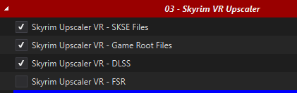
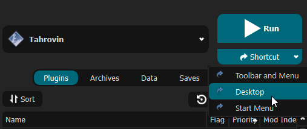
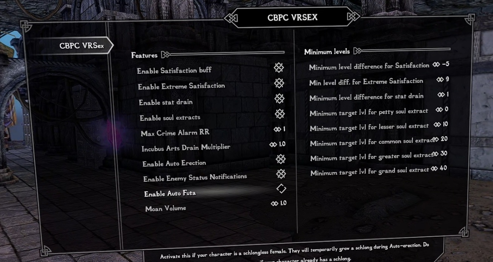
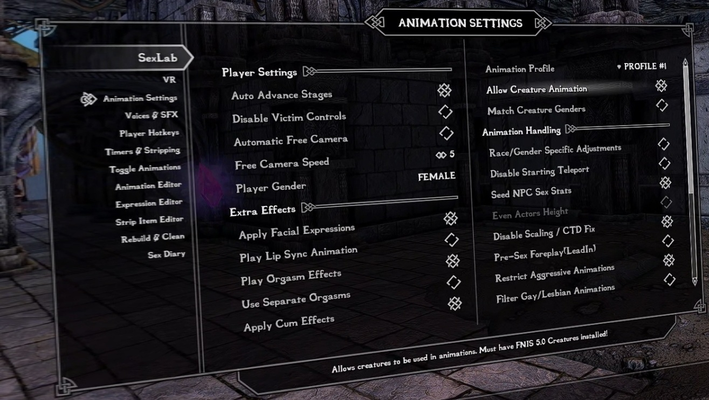
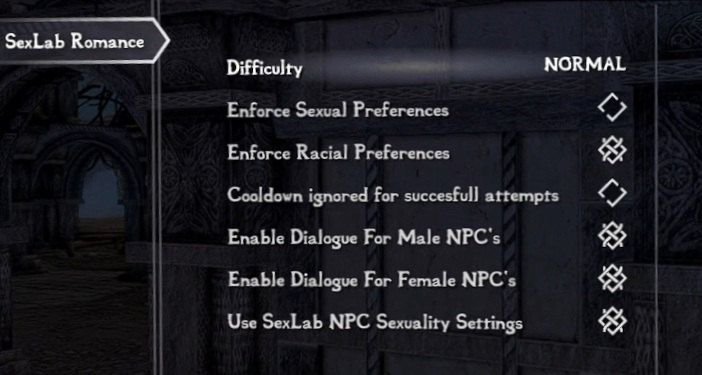

# Installation
Please follow all of steps below if it is your first time installing this modlist, if you're updating you can [jump straight there](#updating-tahrovin).

## Preparation

### Install Microsoft Visual C++ Redistributable Packages
This package is a must as it is needed by MO2 - you may already have it if you've used MO2 before. If you do not have it, you want to download the x64 version under "Visual Studio 2015, 2017 and 2019".

[Download Visual C++ Redistributable Package.](https://docs.microsoft.com/en-us/cpp/windows/latest-supported-vc-redist?view=msvc-170)

### Setup your Page File
Skyrim modlists need a large amount of memory purely because of the amount of *stuff* in them - especially modlists on the larger side or with a lot going on, like Tahrovin. For the best experience, you should setup a pagefile of at least **20GB** - yes, even if you have a million GB of RAM. To setup your pagfile;

1. Hold down the *LEFT* Windows key and press **R**
2. Type in `systempropertiesadvanced` in the run box and then press ENTER
3. Under the "Performance" option, click the "Settings..." button
4. Switch to the "Advanced" tab
5. Under "Virtual Memory", click the "Change..." button
6. Uncheck `Automatically manage...` if it's checked
7. Select your *fastest* SSD in the list of drives
8. Check "Custom Size"
9. Set `Initial Size` to 20480
10. Set `Maximum Size` to 20480 also
    1.  *Note: you can set this up to 40000 if you have the space, this will let the pagefile expand to as large as 40GB*
11. Press the "Set" button
12. Press OK
13. Press APPLY and then OK
14. Restart your PC to apply the pagefile setting

### Setup your Shader Cache
Driver defaults from NVidia and AMD for shader cache size is limited to 4GB. Being this small can lead to rare crashes in heavily modified Skyrim installs. Increasing the shader cache size is done via the NVidia Control Panel (I assume the same for AMD users is true also but I don't have AMD hardware to check with). 

*These instructions are NVidia specific as it is the hardware I have.*

1. Open the NVidia Control Panel
2. Head to `Manage 3D Settings`
3. Scroll down in `Global Settings` to find the `Shader Cache Size` option
4. Set the Shader Cache to *at least* 10GB
5. Done

### Configuring Steam
In both global and game settings within Steam and Oculus settings you must ensure the following is set:
  * Supersampling is *OFF*
  * Render Resolution to 100% (1.0 if you're looking at Oculus settings)

### Disable Steam Overlay
The Steam overlay is known to cause issues for both Skyrim VR and regular Skyrim SE/AE, especially when using ENBs. I recommend you turn it off to be sure that it doesn't interfere in any way and you can do so by heading into Steam, right
clicking on Skyrim VR in your game library and clicking **Properties** > **General** > **Deselect "Enable Steam Overlay while in-game"**.

### Set game language to English
Wabbajack and some/most of the modding tools out there only support English language versions of Skyrim. Setting the language to English in Steam will stop issues like Wabbajack file verification failures when installing. As with disabling the overlay, right click on Skyrim VR in your game library and click **Properties** > **Language** > **Select English**.

### Change Steam's Updating Behavior
If for some reason Bethesda decide to release an update for Skyrim VR, everything will probably break. Well, not *everything* but something will definitely break until mods can be updated to suit. To stop this from happening, you need to tell Steam that you only want to update when you tell it to. You can do this by right clicking on Skyrim VR in your game library and clicking **Properties** > **Updates** > **Change Automatic Updates to "Only update this game when I launch it"**. Whilst you're in here, it's also recommended to disable Steam Cloud too.

### Clean current Skyrim VR installation
If you have not yet installed Skyrim VR, you can skip this part.

1. Right click on Skyrim VR in your game library and click **Properties** > **Local Files** > **Browse**. 
2. Uninstall the game via Steam - right click on Skyrim VR in your game library and click **Manage** > **Uninstall**.
3. Check the explorer window for any left over files - if there are any, delete them.
4. Open Windows start menu/search and type in `%LOCALAPPDATA%`.
5. Delete the Skyrim VR folder.
6. Head to `Documents\My Games` and delete the Skyrim VR folder.

### Install Skyrim VR
Once you've done the steps above, you can now set Steam to download Skyrim VR again but ***do not*** install Skyrim VR to a protected folder, such as `Desktop`, `Downloads` or `Program Files` of any kind. It's best to create a new, dedicated folder for it using the Steam Library function somewhere on the root of your drive such as `C:\SteamLibrary`. A lot of people have a dedicated secondary drive for their games, keeping the OS install separate; using this secondary drive will also work.

### Start Skyrim VR
That's right - start the game. You need to let the game do its initial start up jobs such as creating registry entries and generating default config files. Once you've gotten to the main menu you can close the game again.

## Wabbajack
Installing the list is straight forward, Wabbajack will do most of the heavy lifting for you - you only have to tell it where to put stuff. Grab the Tahrovin from the Wabbajack UI, once its downloaded the initial stuff it needs, Wabbajack will have 2 things for you to do - fill in the installation location and the download location. 

Set the installation location to a folder on the root of a drive, something like `C:\Tahrovin`. Do not install it to one of the protected folders as mentioned earlier. The download location will have likely been filled in for you too - ensure it matches the directory you set for the installation location, or if you have multiple Skyrim VR modlists installed, use a common download folder - this will stop you from having to redownload common mods across multiple modlists. Note that **if your download folder is nested inside your modlist installation folder, it will be erased every time you reinstall** and you will have to download all the mods again.

Before you hit **GO**, a quick tip:

*To get the best performance with Wabbajack, it is recommended that you have the install folder for Wabbajack, the modlist folder and the downloads folder on an SSD; ideally the same SSD.* After the installation is complete, you can move the downloads folder to a storage HDD or other storage medium to save space on your game installation drive. It's not recommended to allow your drive to exceed 90% of its storage space used - Windows Explorer will show a red bar under your drive if you do go over 90% so you need to be sure that you have enough space on your installation drive so that you won't exceed this 90% storage level.

Once you have everything set in Wabbajack, hit **GO** and let it do its thing. It might take a while as there is a fair bit to download and the speed of this will depend on your internet performance as well as your CPU in the later stages for hashing and unpacking the downloads.

## Commonly Failing Downloads
Downloads from file hosts such as Google Drive and Mega can sometimes be a pain and refuse to download automatically via Wabbajack for reasons unknown. Any files that might give you trouble [can be found here for manual download](https://github.com/iAmMe27/Tahrovin/wiki/Commonly-Failing-Downloads).

Download these files and place them *as they are* into the same folder you told Wabbajack to put your downloads in. Let me reiterate just to be sure - **do not unzip the archives!**

## Troubleshooting
If you're having issues with installation, check the [troubleshooting page](Troubleshooting.md). 

# Post-Installation
Almost there but we're not out of the woods yet! After Wabbajack has given you the installation successful screen, you're free to close it. Navigate to the Tahrovin installation folder and run MO2 by double-clicking `ModOrganizer.exe`.

***DO NOT UNDER ANY CIRCUMSTANCES RUN LOOT. The load order is exactly as intended out of the box and you do not need to change it.***

## Stock Game
Tahrovin utilises the stock game feature offered by Wabbajack, meaning that Wabbajack will make a local copy of your Skyrim VR game files during the installation process. This means that your Steam installation of Skyrim VR is completely untouched, even by files that go in the game folder such as ENB files.

## Community Shaders
As a note the first time Community Shaders runs it will have to compile shaders, this may take a while and may look like SkyrimVR is frozen, just be patient. This process will also most likely be repeated any time you change mods in the list.
The Community Shaders Menu can be opened with END and from here you can toggle individual shaders on and off.

## Skyrim VR Upscaler Selection
Like in the previous section, Skyrim VR Upscaler options are found in MO2 under the `Skyrim VR Upscaler` separator. 

Remember, AMD and non-RTX GPU's must use **FSR** and not DLSS or DLAA.

## Creating a desktop shortcut
Nobody wants to be launching their game via multiple clicks, they want to be able to do it from the desktop! This is simple to do - open MO2, ensure **Tahrovin** is selected in the dropdown and click the "Shortcut" button. From the small dropdown menu, click "Desktop". Of course, you can always run from inside of MO2 by clicking the "Run" button instead.

Done! You should now have a shortcut on your desktop which you can now run the modlist from. Don't run Skyrim VR from within Steam as it won't launch MO2's virtual file system to make a modded game instance.

## Swapping between SteamVR and OpenComposite Binaries
See Oculus performance tips
[Oculus Performance Tips](Performance Tips.md)

# Pre-Game Launch

**Before launching the game, make sure your VR headset is initialised and both controllers are connected. Launching the game, without both of these conditions met will be a bad time.**

## DLSS/FSR/XeSS

Refer to the [Skyrim VR Upscaler](#skyrim-vr-upscaler-selection) section.

## Optional mods

Before starting, you can make choices in the Optional sections of the list, colored in Orange in MO2. Pick a set of controller bindings, a defeat mod, a Vampire Lord body mod depending on your character's gender, and any of the other optional mods that interest you. Make sure to do so **before you start a new game** as enabling or disabling some of these mods mid-save can be a bad idea : 

- Vanilla Start : New games will start with the vanilla skyrim intro instead od throwing you straight into the Realm of Lorkhan
- Quickloot VR : Adds a looting menu similar to the one present in FO4
- Smalls : Adds underwear to bodies when you loot them, doesn't work well with Quickloot.
- Shadow of Skyrim - SL on defeat : Defeat system. Starts a sexlab scene whenever you are defeated by an enemy. It is integrated into the Shadow of Skyrim Nemesis system, but there's no configuration available to customize it. **Disable this if you don't want to get a forced sex scene on defeat.**
- Yamete Redux : Alternative defeat system. It will require manual MCM configuration and is known to be finnicky.
- CBPC VRSex - Sexlab Solutions Override : Will use the CBPC VRSex system instead of Sexlab to handle any sex interactions started by the Sexlab Solutions mod between the player and a female NPC, as long as the player is not in a victim context.
- Dragonborn speaks naturally : Grants the ability to use voice commands to do things such as equip spells and items, shout, or select dialogue options. Requires Windows speech recognition.
-  Occlusion FPS Boost : Should give you an FPS boost when outside, at the cost of some rare flickering in specific places (detected on some setups in the Windhelm bridge and on the College's bridge)
-  Daedric Bitchs : Optional followers 
-  Additemmenu : Lets you add items as you wish
-  Strafing Nerf : Reduces your speed when going backwards or strafing to the side, making it a bit harder to avoid attacks and run circles around your enemies
-  Subtitles VR : Allows you to have multiple subtitles displayed at once. Can get a bit janky, but useful when you have a lot of followers.

### Block and parry settings
Pick only one of the options given.
- Vanilla blocking will let you block by placing your weapon and/or shield at a certain angle. This can also be annoying if you block without meaning to, since it will slow you down and stop your stamina regeneration.
- Pseudo-physical parrying will parry by intercepting the enemy's weapon, and block with shields by pressing the trigger (and having the shield not too far from the enemy's weapon).

If you have enabled Vanilla blocking but it doesn't work properly, check Documents\My Games\Skyrim VR for the SkyrimCustom.ini file and delete it.

### Body presets
Pick only one of the options given.
- Limited body presets will limit most NPCs to a handful of slightly more grounded body presets, but specific NPCs will still have presets with more impressive proportions assigned. So while some random guard won't be walking around with the biggest pair in skyrim, you might just find that at the temple of dibella.
- Fantasy body presets will allow most NPCs to have any body type preset, including those with impressive proportions. Some NPCs will still have presets specifically assigned to them however.

### Music replacement
- "Unique Battle Music" and "Combat Music Fix NG - Unique Battle Music Patch" : Replaces the combat music. Different tracks are used for different types of monsters (animals, undead, bandits, etc). Bosses have separate tracks. Special bosses have their own unique tracks.
- "Music Type Distributor" and "Personal Music Framework" : Allows you to add any Personal Music Framework compatible music replacer. There are none included in the list.
- "PMF - Personalized Music Patch" : Requires Music Type Distributor and Personal Music Framework. Allows you to add any Personalized Music compatible music replacer.
- "Emeratu" and related mods : A Personalized Music compatible music replacer. Requires Music Type Distributor,  Personal Music Framework and PMF - Personalized Music Patch.
- PMF - Personalized Music Combat - Incompatible with UBM : Replaces the combat music as well with the one from your Personalized Music compatible music replacer. Takes precedence over Unique Battle Music, use one or the other.

In short, if you want unique combat tracks and new tracks for everything else, activate everything except "PMF - Personalized Music Combat - Incompatible with UBM". Feel free to leave the plugins at the bottom, they won't conflict with anything else. 

Feel free to use any music replacer instead of Emeratu. As long as it is compatible with Personalized Music or Personal Music Replacer, it should work with no conflicts at all.

# Mod Setup

### *THIS STEP IS IMPORTANT! IF YOU DO NOT DO THIS STEP, YOUR GAME WILL NOT FUNCTION CORRECTLY!*

When starting a new game, create your character and once done, *DO NOTHING ELSE* and allow the mods to initialise. Once the notifications stop appearing in the top left of your view, you should calibrate VRIK by using the `VRIK Calibration Power` located in your powers menu. Do this while standing on a flat surface in game. Follow the instructions in the VRIK pop-up dialog to ensure you get this right, otherwise you might find yourself towering over everyone else or way too short. Don't worry about making it absolutely perfect, you can recalibrate at any time. After you've calibrated VRIK, head to the Mod Configuration Menu to start the mod setup.

The MCM setup is *mostly* automated and will run on its own after you've finished character creation. As mentioned, *DO NOTHING* until the window pops-up telling you to save.

When you are done, **save your game, go back to the main menu, then load that save** so the last few mods can load properly.

Modifying the CBBE 3BA and/or HIMBO morphs in the racemenu during character creation is not recommended. Instead, after reloading your game, you should use the autobody shortcut (right thumbstick + controller down) to select a body preset for your character.

That done, there are optional configuration changes you may wish to make in the Mod Configuration Menu :

- The CBPC VRSex mod will create basic sex interactions with NPCs without taking control of the player, but requires the player to have a penis. If you wish to use it but are playing a female character, the mod can let your character grow a penis temporarily during VRSex scenes. Go to CBPC VRsex and check the "Auto-futa" option. Don't check the option if you are playing a male character, or a female character that is already permanently futa. *(Edit : Penis not required anymore, though you can still add it if you like)*

- Creature animations may play if you selected a defeat mod among the optional NSFW mods, or if you use the Sexlab Enchantress spells. If you would like to disable them, go to Sexlab > Animation Settings > Allow Creature Animation.

- Sexlab Romance will give you [Romance] dialog prompts to attempt to seduce any NPC by default. If you would like to limit this, disable the "Enable Dialogue for Male NPCs" and/or "Enable Dialogue for Female NPCs" options in the Sexlab Romance MCM.

- The Imaginator MCM will allow you to adjust your game's visual settings to your liking.

# Updating Tahrovin
When an update is released, please always check the [changelog](Changelog.md) first. You may not need to update your modlist but if there is anything that resolves game breaking issues, it'll be noted in the changelog. Backup your saves before you commit to any updates, Wabbajack doesn't usually touch save files, it does has the ability to delete them if it wanted to.

If you have added anything to this modlist at all, Wabbajack will also delete those. You should know how to stop it from doing this if you're going to add stuff to modlists but if you don't, you have to prepend your mod name with `[NoDelete]` - this will make Wabbajack ignore these files. You will need to reinstall these mods and re-sort their load order after an update though, so I hope you kept backup information on where they went in the load order!

All that aside, updates are basically the same as an installation except you have to ensure that you have the "Overwrite" checkbox ticked in Wabbajack.

# Uninstalling Tahrovin
No fancy uninstallation needed, you can just delete the Tahrovin folder and it'll be gone. There'll be no files left inside your Steam installation folder because Tahrovin uses the stock game feature of Wabbajack.
