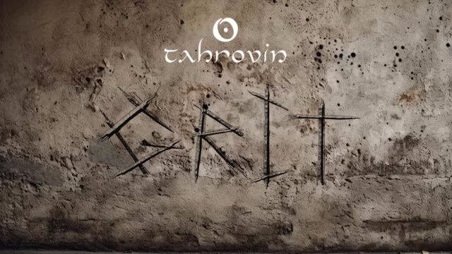

First things first: **this list contains adult content and you must be of legal age in your country. This means 18+ in most countries, 21+ in others. It is up to you to be sure of the age requirement in your country. Tahrovin is a collection of different mods from various sources, it does not reflect the views or opinions of any mod author's featured in the list.**

***Having issues with the modlist? [FAQ \& Common Issues](#faq--common-issues)***

Support and general talk about Tahrovin resides on iAmMe's Discord:

Want an idea of what the list plays like ? [I made a video](https://odysee.com/$/embed/@Aeloverim:7/TahrovinGritIntro:2?r=3Lr3Zfv8p6NtvXgznroYw94PqUVBocA7) of the first hour or so of gameplay, all the while explaining various grit-specific concepts. Note that this is in "Grit - Performance" profile, so not as pretty as it gets, and that I am very much not a native english speaker so you probably won't understand me all the time. 

# What is Tahrovin Grit ?
Tahrovin Grit is a fork of Tahrovin, a NSFW Skyrim VR modlist. It retains some of the eye-candy its predecessor is known for, but opts for more grounded outfits and slightly less intrusive NSFW mods. It also features light survival gameplay and aims towards a slower-paced character growth, reworking many gameplay mechanics to provide a well-balanced challenge throughout your playthrough.

# Before You Start
Before you dive in, there's a couple things you need to be sure of first:

## Hardware Requirements
The following specs are recommended at minimum:
  * CPU: Intel 7th gen *OR* AMD Ryzen 3000 series 
  * RAM: 16GB of DDR4
  * GPU: RTX 2060 *or the AMD equivalent with at least 6GB of VRAM*

You will need at least `205GB` of disk space on an SSD for the installation. For the downloads, you will need an extra `86GB`- ideally you want *at least* `330GB` for temporary Wabbajack work space. It doesn't have to be an NVMe SSD, but a HDD of any kind will make the list painfully unplayable. 

**If your hardware is less powerful, try the performance tips [here](#my-performance-is-really-bad)**

**If you are using a Quest 2, there are a couple of performance recommendations that you can [find here](Oculus%20Performance%20Tips.md) if you are struggling to get the game to run well.**

## Accounts
In terms of accounts you will need:
  * Nexus Premium Account
  * LoversLab Account

Whilst you don't *need* a Nexus premium account to install the modlist, you'll have a considerably better time of it if you do.
[GitHub Pages / Actions workflow]: https://github.blog/changelog/2022-07-27-github-pages-custom-github-actions-workflows-beta/
[use this template]: https://github.com/just-the-docs/just-the-docs-template/generate
